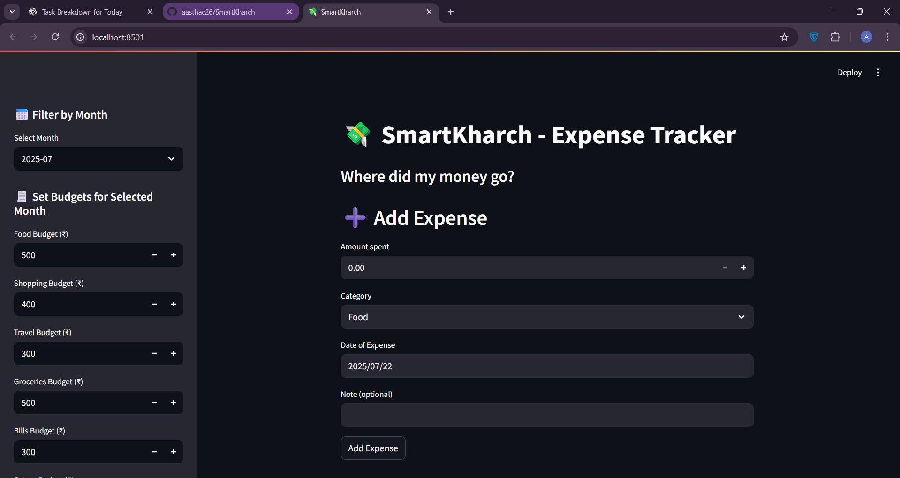
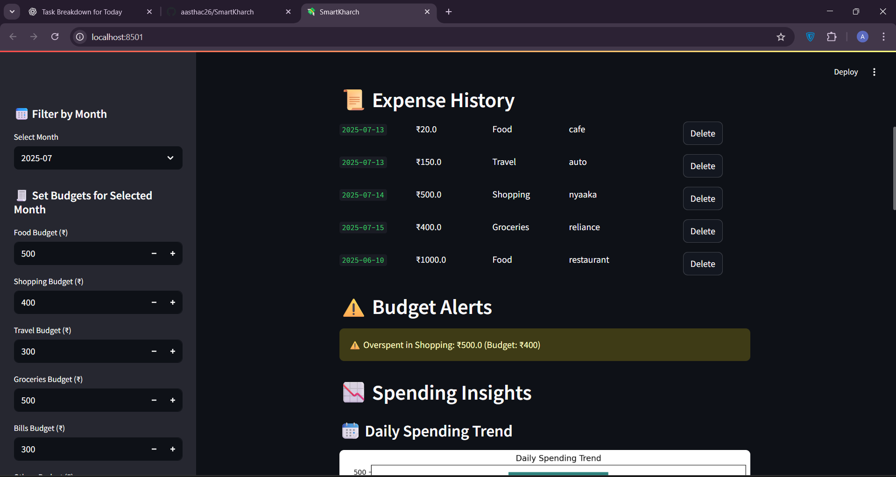
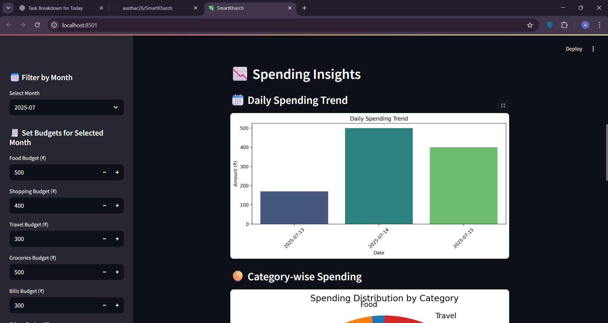
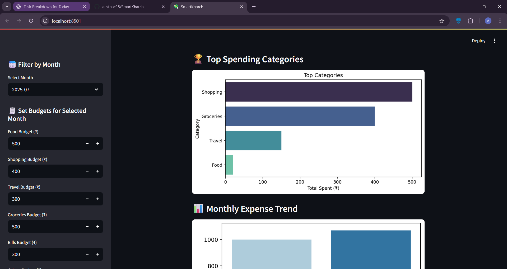

# SmartKharch 💸

SmartKharch is a personal budget tracking app built with **Streamlit** and **Python**. It allows users to:

- Upload and analyze daily spending data
- Visualize expenses through charts
- Track spending by categories and time
- Get alerts when monthly budgets are exceeded

## 🛠️ Tech Stack
- Python
- Streamlit
- Pandas
- Matplotlib / Seaborn

## 📸 Screenshots

### Data Entry

### Data and alerts

### Analytic View

